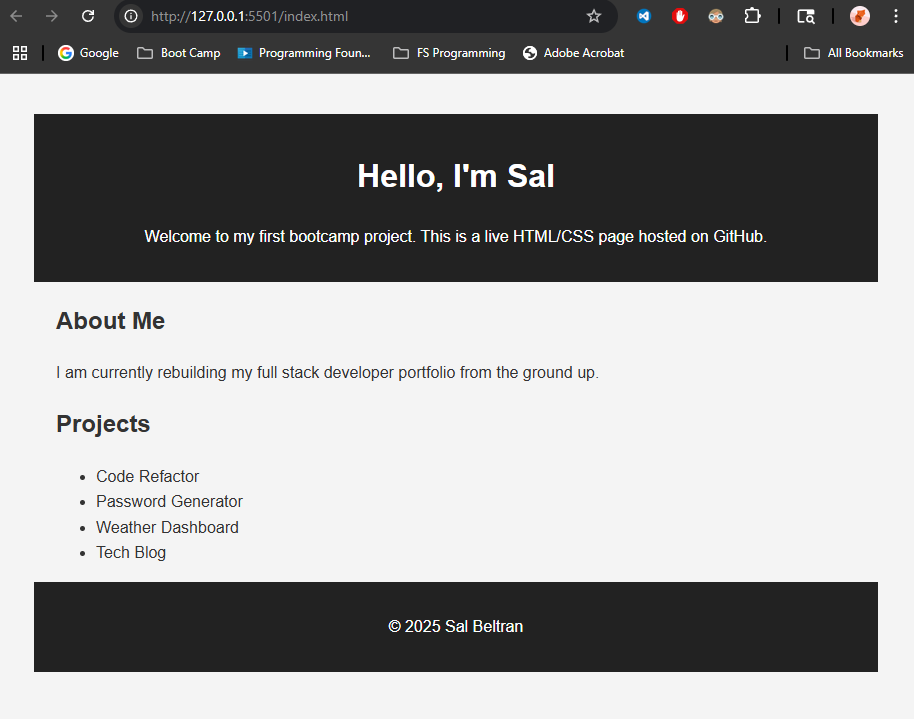

# Code Refactor

## Description
This project involved refactoring a poorly structured HTML/CSS marketing page to improve its semantics, accessibility, and maintainability without changing its visual layout.

## Technologies Used
- HTML5 (semantic tags, structure)
- CSS3 (cleaned styles)
- Git/GitHub

## Key Improvements
- Semantic elements (`<header>`, `<section>`, etc.)
- Improved accessibility (alt text, headings)
- Consolidated CSS for easier maintenance

## Link
[Live Site](https://itsyourpalsal18.github.io/01-code-refactor)

## Screenshot

## License
MIT
